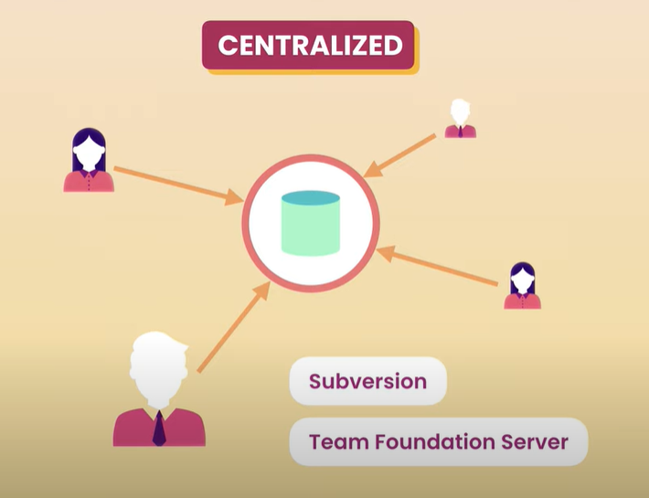
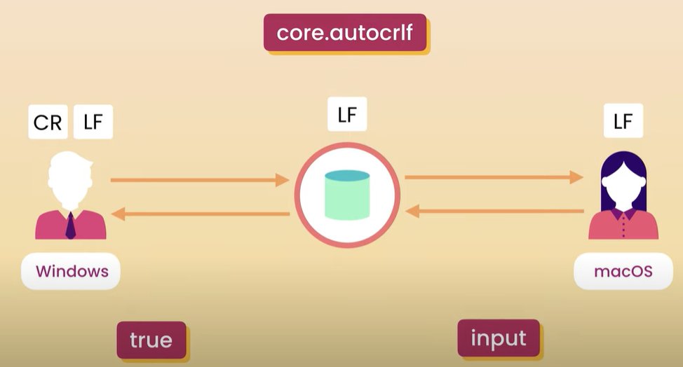
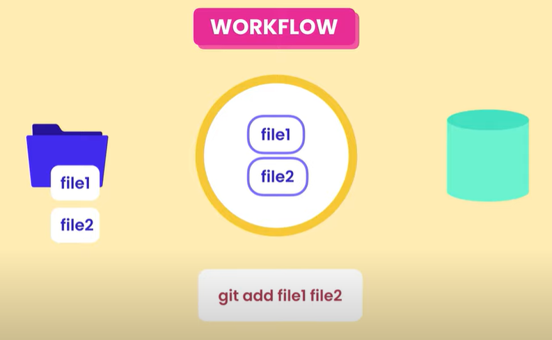
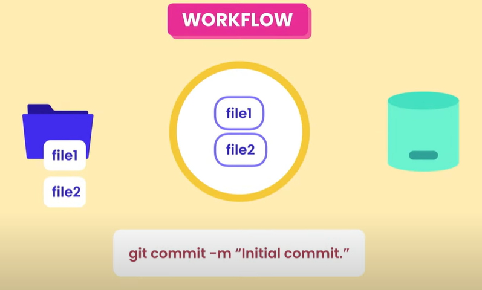

# Git Introduce

## 2 Types of Version Control System

- Centralized
- Distributied

### Centralized Type



### Distributed Type


## Why Git

- Free
- Open Source
- Super Fast
- Scalable
- Cheap Branching/Merging

## Extension Tools for VS Code

GitLens - Git supercharged

## Git GUI IDE

all list in website: https://git-scm.com/downloads/guis

### 2 top popular Git UI IDE

| GIT IDE Tools | Remark                                                     |
| ------------- | ---------------------------------------------------------- |
| GitKraken     | not free for commercial, but free for personal development |
| SourceTree    | free for Windows and Mac                                   |

## Why need Git Command Line

- GUI tools have limitations
- GUI tools are not always available

# Git Settings

- Name
- Email
- Default Editor
- Line Ending

## Setting Scope

| Level  | Remark                               |
| ------ | ------------------------------------ |
| System | All users                            |
| Global | All repositories of the current user |
| Local  | The current repository               |

## Setting Command

### user name

```
git config --global user.name "shamin"
```

local

```
git config user.name "shamin"
```

### user email

```
git config --global user.email xxxx@xxx.com
```

### code edit (VS Code)

```
git config --gloabal core.editor "code --wait"
```

### <a name="git_config">git config</a>

```
git config --global -e
```

## core.autocrlf

### Difference between windows and macOS

| Windows | macOS |
| ------- | ----- |
| abc\r\n | abc\n |

\r = carriage return

\n = line feed

### autocrlf Behavior



### autocrlf setting command

windows

```
git config --global core.autocrlf true
```

macOS

```
git config --global core.autocrlf input
```

## git config command

git config command help (open a web page)

```
git config --help
```

git config command parameters

```
git config -h
```

git config variables list

```
git config -l
```

# Git Base Command

## Initial Repository

create a local git repository for a project

```
git init
```

view files

```
ls
ls -a
```

re-initial an empty git repository for current project

```
rm -rf .git
git init
```

## Workflow

### add files

```
git add file1 file2
```



### add all files not sub directories

```
git add .
```

### add all files include sub directories

```
git add -A
```

### add specific files

```
git add *.cs
```

### add changed files into staging area

```
rm file_name
git add file_name
git ls-files
```

the result won't output file_name any more.

### view changes status

```
git status
```

```
git ls-files
```

### remove files from both working directory and staging area

```
git rm file2.txt *.txt
git rm -f file2.txt *.txt
```

### commit changes

```
git commit -m "initial commit"
git commit -am "initial commit with all files"
```



### commit information

- ID
- Message
- Date/Time
- Author
- Complete snapshot

## git ignore

### create a git ignore file

```
echo logs/ > .gitignore
code .gitignore
```

### edit .gitignore file

```
logs/
bin/
debug/
test.txt
*.bac
backup.txt
```

### add and commit .gitigore

```
git add .gitignore
git commit -m "add logs .gitignore"
```

it will impact the git repository

### remove one item in .gitignore when commit

temp remove settings in .gitignore

```
git rm --cached -r bin/
git ls-files
```

above command won't list any files under "bin/"

check change status, we will see the changes

```
git status
```

```
git status -s
```

check output result:

??  = the changes which have not been added into stage

M = modified files

A = new files

### gitignore reference template

https://github.com/github/gitignore

## View code changes

### view staged changes

```
git diff --staged
git diff --cached
```

### view both staged and unstaged changes

```
git diff HEAD
git status -vv
```

### view diff for branches

```
git diff branch1..branch2
```

### view diff for commit

```
git diff 1234abc..6789def
```

### view diff for last commit and current commit

```
git diff HEAD^ HEAD
```

### view diff for specific file

```
git diff myfile.txt
git diff directory
git diff 27fa75e myfile.txt
git diff 27fa75e ada9b57 myfile.txt
git diff ada9b57 my_branchname my_changed_directory/
```

### view current changes

```
git diff -v
```

### view summary of changes

```
git diff --stat <branch/commitId>
```

### set vscode as difftool

```
git config --global -e
```

```
[core]
  editor = code --wait --new-window
[diff]
  tool = vscode
[difftool "vscode"]
  cmd = code --wait --diff --new-window $LOCAL $REMOTE
[merge]
  tool = vscode
[mergetool "vscode"]
  cmd = code --wait --new-window $MERGED
```

### use vscode for difftool

```
git difftool -t vscode --dir-diff
```

### set beyondCompare as difftool

```
git config --global difftool.bc3.path 'c:\Program Files (x86)\Beyond Compare 3\bcomp.exe'
git config --global diff.tool bc3
```

### set Intellij as difftool

```
[diff]
    tool = intellij
    guitool = intellij
[difftool "intellij"]
    path = D:/Program Files (x86)/JetBrains/IntelliJ IDEA 2016.2/bin/idea.bat
    cmd = cmd \"/C D:\\workspace\\tools\\symlink\\idea\\bin\\idea.bat diff $(cd $(dirname "$LOCAL") && pwd)/$(basename "$LOCAL") $(cd $(dirname "$REMOTE") && pwd)/$(basename "$REMOTE")\"

[merge]
    tool = intellij
[mergetool "intellij"]
    cmd = cmd \"/C D:\\workspace\\tools\\symlink\\idea\\bin\\idea.bat merge $(cd $(dirname "$LOCAL") && pwd)/$(basename "$LOCAL") $(cd $(dirname "$REMOTE") && pwd)/$(basename "$REMOTE") $(cd $(dirname "$BASE") && pwd)/$(basename "$BASE") $(cd $(dirname "$MERGED") && pwd)/$(basename "$MERGED")\"
    keepBackup = false
    keepbackup = false
    trustExitCode = true
```

### output changes into a patch file

```
git diff --no-prefix > diff_file.patch
```

## View history

### view history detail

```
git log
```

### view history in oneline

```
git log --oneline
git log --oneline --reverse
```

### view top commits

```
git log -n
```

n is previous commit index: 0,1,2,3,4..., 0 is latest commit

### view commit

```
git show <commitId>
```

```
git show HEAD~
git show HEAD~n
```

n is previous commit index: 0,1,2,3,4..., 0 is latest commit

### view commit specific file changes

```
git show HEAD~2:<file_name>
```

### view commit files with tree structure format

```
git ls-tree HEAD~2
```

### Git Objects

- Commits
- Blobs(Files)
- Trees(Directories)
- Tags

## Unstage changes

### unstage specific files

```
git restore --staged file1 file2
```

### unstage all files

```
git restore --staged .
```

### discard all changes (be careful)

```
git restore . 
```

### remove non-add files and directories

```
git status -s
git clean -fd
git status -s
```

it will clear all "??" items

### restore a file to earlier version

lastest version deleted a file "hello.txt", now we will restore this deleted file.

```
git restore --source=head~1 bin/hello.txt
git ls-files bin
git add bin/hello.txt
git status -s
```

head~1 is the previous version which is before the latest version.

# Upload local repository to Github

## step1: create a new repository in GitHub

generate the git repository remote url

```
https://github.com/shamin1110/git_selfstudy.git
```

## step2: init local git repository 

using following command

```
git init
git add .
git commit -am "inial version"
```

## step3: link remote repository with local

```
git remote add origin https://github.com/shamin1110/git_selfstudy.git
```

or

```
git remote set-url origin https://github.com/shamin1110/git_selfstudy.git
```

## step4: push local to remote repository

```
git push -u origin master
```

about push access right, follow [git config](#git_config) section to set your email, name

# Development Command

## checkout a branch base on master

### fetch 

```
git fetch origin
git fetch origin/master
git fetch origin master
```

### pull

```
git pull
git pull origin/master
git pull origin master
```

### checkout

```
git checkout -b [new_branch] [source_branch]
git checkout -b develop master
```

### stage

```
git add file1 file2 file3 ...
```

### commit

```
git commit -am "some comments"
```

### stash

```
git stash
```

save temp check-out codes to stash,  then restore to origin version

### pull source again and ready to merge

```
git checkout master
git pull
```

### rebase

```
git checkout develop
git rebase origin/master
git rebase origin master
```

will display merge items in VS if conflict exist, then finish merge in VS and force push

### merge

merge develop branch into master

```
git checkout master
git merge develop
```

### push

soft push if no conflict happened

```
git push
```

force push if finished merge

```
git push --force
```

### stash pop

once finished merge codes into master, we can continue modify codes in develop branch, then restore backup codes.

```
git checkout develop
git stash pop
```

### push local branch to remote server

```
git push -u orgin develop
git push --set-upstream origin develop
```

## Other commands

### unstage last commit

```
git reset head~
```

### soft remove commit and keep changes

```
git reset --soft head~
```

### hard remove commit and remove changes

```
git reset --hard head~
```

### delete local branch

```
git branch -d [branch_name]
```

### delete remote branch

```
git push origin --delete [branch_name]
```


